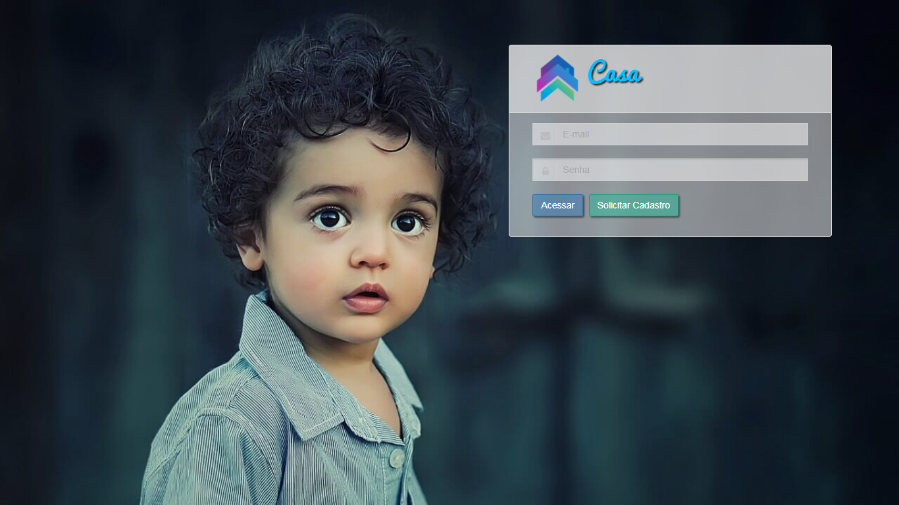

# Sistema Casa

## Sumário

> * [Objetivo](#objetivo)
> * [Justificativa](#justificativa)
> * [Visão Geral](#visão-geral)
> * [Requisitos Técnicos](#requisitos-técnicos)
> * [Acessos Para Conhecer o Sistema](#acessos-para-conhecer-o-sistema)
> * [Executando o Projeto](#executando-o-projeto)
> * [Contribuindo](#contribuindo)

## Objetivo

O objetivo deste projeto é desenvolver um software open source para administrar os processos de adoção de um orfanato, capaz de manter os dados dos adotivos e adotantes, realizar um controle de visitas e fornecer relatórios informando as visitas futuras e realizadas com cada criança para melhor controle do orfanato.

## Justificativa

Notou-se que muitos aplicativos ou sistemas online desenvolvidos para orfanatos são focados na parte de contribuição, auxiliando as entidades no recebimento de doações e também informando aos doadores para que eles saibam a real necessidade da instituição.

Um exemplo de um aplicativo para smartphones e web neste âmbito é o CADA (Carinho, Amor, Dedicação e Ajuda), um software desenvolvido por um grupo de cinco alunos da  Fundação Centro de Análise Pesquisa e Inovação Tecnológica (FUCAPI) sob a orientação dos professores do Projeto Brazilian Education Program for IOS Development (BEPiD) tendo como prioridade a comunicação entre as entidades e os doadores, criando uma espécie de “catálogo” de instituições e orfanatos, ajudando-os a administrarem as doações recebidas e possibilitando que os doadores acompanhem claramente as ações tomada pela instituição.

O aplicativo foi desenvolvido em duas plataformas. A plataforma web foi desenvolvida para a efetuação de cadastro do abrigo no site do CADA. A partir desse cadastro é possível informar quais os produtos que o local mais necessita. A segunda plataforma é um App com notícias do abrigo, pontos de coleta dos orfanatos e informações gerais referentes à doação. No momento as duas plataformas estão passando por alguns ajustes, mas a previsão é que logo o sistema esteja disponível para uso.

Atualmente, o único sistema em uso, conhecido e focado no processo de adoção é o Sistema de Controle de Acesso do Conselho Nacional de Justiça  sendo um sistema de informações, que consolida os dados de todas as Varas da Infância e da Juventude referentes a crianças e adolescentes em condições de serem adotados e os pretendentes habilitados à adoção.
Todos os juízes, de todo país, têm acesso à relação e perfil de pretendentes e crianças cadastradas no CNA. A retirada do cadastro das crianças e adolescentes pode ocorrer por adoção, pelo fato de terem atingido 18 anos ou por óbito.

## Visão Geral

Crianças para Adoção Salvas pelo Afeto (CASA) é um sistema para gerenciamento de cadastros de adotantes e adotados dentro de um orfanato.

A entrada no sistema é autorizada mediante autenticação por login e senha permitindo o acesso simultâneo de vários usuários ao software.



O sistema conta com três diferentes níveis de usuários, sendo no primeiro nível os administradores de todo o sistema CASA, responsável pela aprovação ou reprovação das solicitações pendentes, cadastro dos administradores de cada orfanato e de novos administradores do sistema.

O segundo é o administrador do orfanato responsável pelo cadastro de usuário padrão, gerar relatórios gerenciais, inativar adotante e adotivo, e possuir todos os privilégios do usuário padrão, sendo o seu acesso restrito apenas aos dados do orfanato em que ele estiver cadastrado, ou seja, este usuário não possui total acesso aos dados de todos os orfanatos cadastrados no sistema CASA.

O terceiro é o usuário padrão, responsável pelo cadastramento e atualização dos adotantes e adotivos, vincular adotantes com adotivos e agendar e registrar visitas.

## Requisitos Técnicos

<table style="width:100%">
  <tr>
    <th>Tecnologia</th>
    <th>Descrição</th>
    <th>Versão</th>
  </tr>
  <tr>
    <td>PHP</td>
    <td>Linguagem de Programação Server Side</td>
    <td>7.1.1</td>
  </tr>
  <tr>
    <td>Laravel</td>
    <td>Framework Server Side</td>
    <td>5.3.31</td>
  </tr>
  <tr>
    <td>MariaDB</td>
    <td>Sistema de Gerenciamento de Banco de Dados (SGBD)</td>
    <td>10.1.25</td>
  </tr>
</table>


## Acessos Para Conhecer o Sistema

O sistema conta com uma versão online: http://casa-sistema.com.br que possui alguns usuários de teste cadastrados no sistema.

<table style="width:100%">
  <tr>
    <th>Nível de usuario</th>
    <th>E-mail</th>
    <th>Senha</th>
  </tr>
  <tr>
    <td>Administrador do Sistema</td>
    <td>adm@casa.com.br</td>
    <td>SenhaCasa</td>
  </tr>
  <tr>
    <td>Administrador da Instituição</td>
    <td>adm@esperanca.com.br</td>
    <td>SenhaCasa</td>
  </tr>
  <tr>
    <td>Usuário Padrão</td>
    <td>padrao@esperanca.com.br</td>
    <td>SenhaCasa</td>
  </tr>
</table>

## Executando o projeto

- Clone este repositório no seu computador
- Baixe as dependências do projeto com os comandos:

  `composer install --no-scripts`

  `npm install`

- Copie o arquivo `.env.example` e renomeie a cópia para `.env`
- Crie uma nova chave para a aplicação:

  `php artisan key:generate`

- Em seguida você deve configurar o arquivo .env colocando informaçõs sobre o nome do Banco, Usuário e Senha.

  ```
  DB_CONNECTION=<MEU_SGBD>
  DB_HOST=<IP_AONDE_O_BANCO_SE_ENCONTRA>
  DB_PORT=<PORTA_DO_BANCO>
  DB_DATABASE=<NOME_DO_BANCO>
  DB_USERNAME=<USERNAME>
  DB_PASSWORD=<SENHA>
  ```

- Depois, rode as migrations com:

  `php artisan migrate --seed`

- Feito isso basta executar o projeto com:

  `php artisan serve`

## Contribuindo

- :star2: Coloca esse projeto nos seus favoritos com um Star
- :fork_and_knife: Faça um Fork do projeto
- :computer: Clone o repositório para o seu computador
- :wrench: Contribua no código ou na documentação do Projeto
- :point_right: Crie um commit com as mudanças e faça um Pull Request (PR)
- :tada: Veja seu Pull Request ser aprovado e repita o ciclo!
